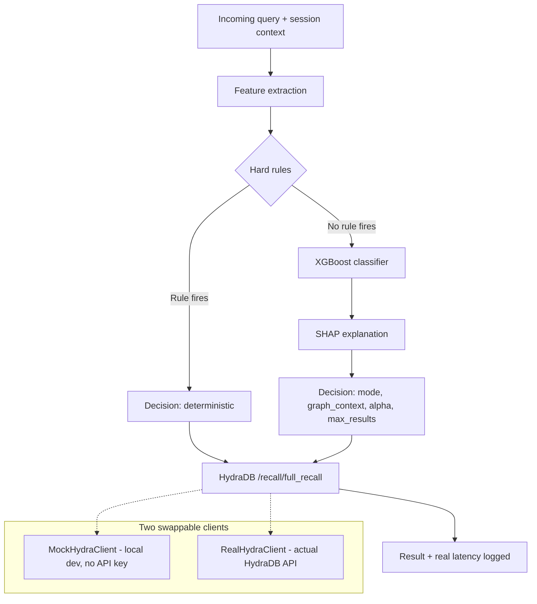

# HydraDB Adaptive Query Router

A small proof of concept built after reading through HydraDB's docs closely enough to notice something: developers calling `/recall/full_recall` have to manually pick `mode` (fast or thinking), whether to include `graph_context`, and a few other retrieval params, every single time. The docs even tell you how to think about the tradeoff by hand. Nobody's automated that decision yet.

This is an attempt at automating it, and being honest about where it works and where it doesn't.

Built and tested on Python 3.11.

## What it does

Given a query, it decides three things before any expensive call happens:

- Should this go through fast mode or thinking mode
- Should graph context be included
- What retrieval params make sense (alpha, max results)

It does this in three layers, cheapest first:

1. **Hard rules** catch the obvious stuff. A query with an exact ticket ID doesn't need semantic search. A short direct question doesn't need multi hop graph traversal. These are plain if statements, not machine learning, and they're the layer doing most of the real work.
2. **A classifier** picks up whatever's left over, the genuinely ambiguous queries the rules can't confidently call.
3. Every model decision comes with a SHAP explanation, so it's never a black box guess.

## Architecture



## Why this exists

HydraDB's own docs describe the fast/thinking tradeoff and tell developers to hand tune it per query type. That's a real, stated pain point, not something I made up to have a reason to build something. The project tries to close that gap the same way I approached an earlier project predicting whether a SQL query would be expensive before it hit an execution engine: extract cheap features, catch the obvious cases with rules, let a small model handle the rest, explain every decision.

## What actually happened when I tested it against the real API

I didn't just build this and assume it works. I ingested real content into a HydraDB tenant and ran real queries against it, and I'm writing up what I found honestly, including the parts that didn't go the way I expected.

**Fast and thinking mode retrieved graph context at the same rate.** Across 25 real queries against real ingested content, both modes hit 100% graph context retrieval. Thinking mode took 78% longer (3.4s vs 1.9s average) for no measurable difference in whether graph data came back at all. My best explanation: on a smaller, densely connected knowledge base, the two modes might not differ much in whether they find something, only in how deep the reasoning goes once they have it. A hit rate metric can't see reasoning depth. This would be worth checking again at a larger, sparser scale.

**That finding broke my labeling approach, and I'm not pretending otherwise.** I was labeling training examples as "needs thinking mode" whenever fast mode failed to retrieve anything useful. If fast mode always succeeds on a given tenant, that condition never fires, so the classifier never sees a real example of "thinking" to learn from. This isn't a bug I patched around. It's a real limitation of the approach that only showed up once I tested against real data instead of a mock.

**The classifier has a known blind spot, and I tried three separate fixes before accepting it as a real limit.** Queries that are relational in meaning but don't use an obvious keyword ("what connects X to Y" instead of "how does X relate to Y") get missed. I tried TF-IDF similarity to a set of example phrases, real sentence embeddings with generic anchor phrases, and real embeddings with anchor phrases rewritten to match the length and style of actual queries. None of the three moved the needle in a meaningful way. I have the numbers for all three attempts if anyone wants to see them, they're in the commit history rather than pasted here.

## What's proven to work

- The hard rule layer is solid. Four deterministic test cases, checked against exact expected output every time I've run this, pass 4 out of 4, always.
- The full pipeline runs end to end against the real API: tenant creation, file ingestion, real graph extraction with real entity types and relationships, real querying, real latency measurement.

That block I just gave you already is the most recent one — since `model.train` never successfully retrained on real data (it kept refusing because the real bootstrapped set only had one class to learn from), the sanity check output never actually changed across any of your later runs. Same model, same numbers, every time. So there's nothing more current to swap in, what you have is what you have, and it's already formatted above.

Here's the whole block again on its own, ready to paste as one piece:

## Sanity check output

This is the real output from `python -m tests.sanity_check`, run against the trained model.

**Rule cases** (deterministic, plain if statements, no model involved)

| Query | Expected | Got | Result |
|---|---|---|---|
| "What's the status of ticket ERR-4021?" | fast, literal_token_exact_match | fast, literal_token_exact_match | Pass |
| "What's our support email?" | fast, short_direct_lookup | fast, short_direct_lookup | Pass |
| "How does the retry policy relate to timeout settings, and why does it depend on the connection pool configuration?" | thinking, strong_relational_signal | thinking, strong_relational_signal | Pass |
| "What did they say about it, and is that still true?" (prior context: 300 tokens) | thinking, coreference_heavy_needs_session_graph | thinking, coreference_heavy_needs_session_graph | Pass |

4 out of 4. This layer is just code, not a model, so there's nothing to argue with here, it either matches or it doesn't.

**Keyword-blind cases** (queries that are relational in meaning but avoid every obvious keyword, checking whether the classifier learned anything beyond string matching)

| Query | Decision | Confidence | Top feature pulling it toward "fast" |
|---|---|---|---|
| "What connects the retry logic to the timeout configuration?" | fast | 0.909 | has_relational_keywords |
| "Is there a link between deploy frequency and incident count?" | fast | 0.896 | has_relational_keywords |
| "What's tying the billing spike to the new pricing rollout?" | fast | 0.942 | has_relational_keywords |
| "Something changed about the access policy since last month, what?" | fast | 0.997 | has_temporal_keywords |

All four came back "fast," and in every case the deciding feature is a keyword flag, not the semantic score. That's the classifier telling on itself. It's picking up on the literal presence of a word like "relate" or "depend" instead of understanding what the sentence is actually asking. I tried to fix this three separate ways, described above, and none of them worked. Knowing exactly where a model breaks and why is more useful than a good looking number that hides the same problem.

## What I'd do differently with more time or real usage data

- Replace the mock bootstrapped training labels with real production query logs and real mode selections, if this were ever adopted for real
- Test the fast vs thinking finding above against a much larger knowledge base to see if the gap actually shows up at scale
- Try a full sentence embedding model fine tuned on relational vs factual intent instead of a fixed small anchor set

## Running it

```bash
python -m venv venv
venv\Scripts\Activate.ps1   # PowerShell
pip install -r requirements.txt

# local dev, no API key needed
python -m eval.bootstrap --client mock
python -m model.train
python -m eval.benchmark --client mock

# against the real API
$env:HYDRA_DB_API_KEY = "your-key"
python -m eval.bootstrap --client real --db-name your_tenant
python -m model.train
python -m eval.benchmark --client real --db-name your_tenant

# sanity checks, rule cases and adversarial keyword blind cases
python -m tests.sanity_check
```

## Stack

Python, FastAPI, XGBoost, SHAP, sentence-transformers, requests. No Go, no separate microservice for the decision layer, on purpose, since the whole point is deciding faster than the call it's routing, and a network hop would work against that.

## Why I built this

I like understanding what a company's actual problem is before writing code, instead of building a generic demo and hoping it lands. This is a real attempt at that, aimed at a real gap I found in HydraDB's own documentation, tested against their real API, with the failures reported alongside the parts that worked.
